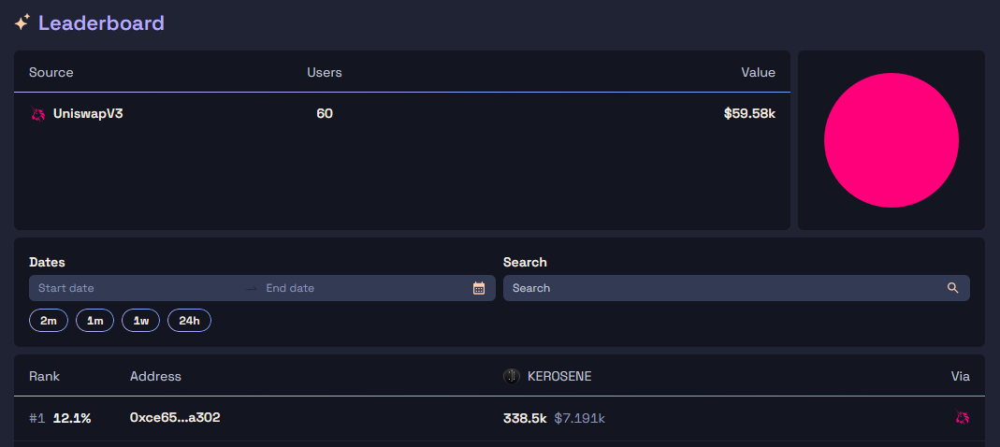

Information up to date as of 2024/06/26. 
# "Kerosene is Not Collateral"

$KEROSENE is meant to be a reflection of the overcollateralization of DYAD, and at the same time, $KEROSENE can be deposited into a Note and _behave_ like collateral to mint DYAD. Essentially, you can use Kerosene as a buffer for liquidation, and this is how you can bring down your legit _for real_ "actual assets" collateralization ratio to a theoretical 1:1 ratio — you cover the remainder with Kerosene.

The docs explicitly state: _"Kerosene is not additional collateral"_. We'll see about that.
# Earning Kerosene

Kerosene is like, _the_ selling point of DYAD which sets it apart from other CDP stablecoins. So how are you even supposed to obtain Kerosene?

Let's throw the tokenomics here:

- Total supply of 1 billion tokens
- 58% will be emitted via liquidity incentives
- 4% for Liquidity Bootstrapping
	- https://app.fjordfoundry.com/pools/0x980b5f5a669ad847177610b838e2d448543e6cac
- 4% will be in an Airdrops (to projects like Milady's)
- 4% allocated to Notes (seems to be an airdrop for holders based on a snapshot)
- 10% for the Team (of course) with a 24 month vest
- 10% to Investors with a 12 month vest
- 10%... Reserve

So we see that the primary method Kerosene will enter users hands and overall circulation will be via liquidity incentives, where you're providing liquidity for DYAD and staking those LP tokens. 

As of right now, this is facilitated through [Merkl campaigns](https://merkl.angle.money/ethereum/pool/0x8B238f615c1f312D22A65762bCf601a37f1EeEC7), where based on your liquidity contributions to the USDC-DYAD UniswapV3 pool you receive some amount of Kerosene on a weekly basis. It seems like the amount of Kerosene up for grabs is directly proportional to the TVL at the time of the snapshot.

This is also where the ridiculously high APR comes from. Currently, there are only 60 LP providers to this pool. [This user](https://merkl.angle.money/user/0xCE655486C6Da0e46219EFB09d653D3362733A302) is the top earner out of all of them, having accrued $7.191k in $KEROSENE rewards from 3 campaigns.

Currently, he's providing $77.28k of liquidity to the pool, with $21.8k being USDC and $55.48k being DYAD. Earning ~$2.34k in rewards per week against his initial puts it at an APR of **~161%**, which is insanity.

Dad always told me there was no such thing as a free lunch, so what's going on here?
# The Flywheel

**_flywheel (/ˈflʌɪwiːl/)_**

noun: _"A flywheel is a heavy wheel that makes an engine move smoothly by storing kinetic energy and keeping the engine at a constant speed throughout its cycle."_

DYAD calls its Kerosene-Notes-DYAD cycle a flywheel. Besides making it sound cooler, the principles aren't super complicated.
## The Ideal Scenario

- TVL increases when people deposit their ETH through Notes
- When the TVL increases, the deterministic value (DV) of Kerosene will increase. Arbitrageurs will bid the market price of Kerosene to match the DV by redeeming free DYAD
	- As of 2024/06/26, $KEROSENE is trading at $0.021 while the DV is $0.0295, which is a pretty big deviation
- APRs will appreciate because Kerosene appreciates as it's the LP reward, so then more people would want to LP
- To LP, you then need DYAD to be minted, which requires you to deposit more TVL, and then the cycle repeats

Handy diagram:

The thing that gets this flywheel going is the growth in TVL, and assuming all goes well in a bull market, ETH should appreciate, bringing up TVL on its own. (Quite obviously, this can and would likely be ponzi'd).

An added effect is that TVL growth and $KEROSENE emissions are not in direct relation, so $KEROSENE's inflation rate resulting from growth in its supply is (ideally) counteracted by the growth in TVL at a disproportionate rate, causing the DV of Kerosene to increase rapidly.

## The Sub-Optimal Scenario

All is fun and games while the TVL is growing, but what if TVL were to decrease due to, say, ETH dumping?

- A decrease in TVL would cause the Kerosene DV to fall as well
- Kerosene market price will fall accordingly as it is now overvalued
	- Recall that Kerosene on the secondary market only ideally matches DV due to the presence of arbitrageurs
	- Arbitrageurs are being gated by requiring Notes to effectively participate in the DYAD minting/burning, so if the market price of Kerosene were to fall under the DV, in this nightmare scenario there aren't enough eligible arbitrageurs to bid the price up
- Farming yields will decrease in turn, which may cause people to withdraw their collateral
	- Users may want to withdraw their collateral in general to avoid being liquidated like hell
- Withdrawal of collateral leads to a fall in TVL, cycle repeats

You can also use $KEROSENE as collateral, so how does that play into this?

- An overall decrease in TVL is a decrease in overcollateralization, which Kerosene represents through its DV
- If the DV of Kerosene falls and its being used as pseudocollateral for someone's loan, then Kerosene devaluing will cause users' collateralization ratio to fall, which may trigger liquidation
	- Recall that the goal of using Kerosene as "not collateral" is to reduce your effective collateralization ratio to "basically 100%". 
	- But assuming large swathes of users does this and the effective collateralization ratio starts to slip, would this not cause a serious depegging event?
- Liquidations have to be settled by other users, and part of the liquidation reward they receive will still be in Kerosene (assuming the implementation follows the current spec)

From how it feels, the flywheel can very much just spin in the other direction...

